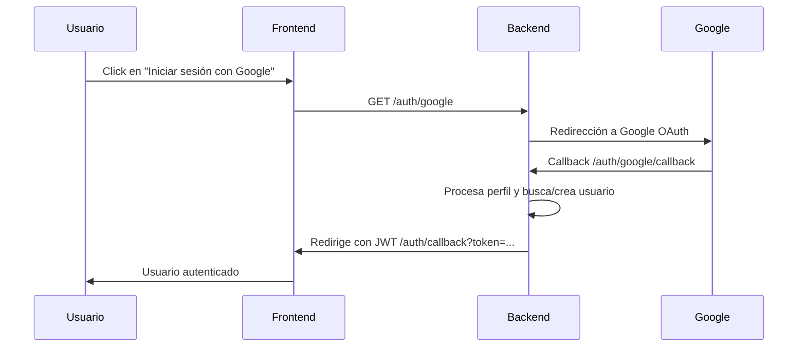

# Documentación: Flujo de Autenticación con Google

Este documento describe el flujo de autenticación implementado en la aplicación usando Passport.js y la estrategia de Google OAuth2.

## 1. Inicio de sesión con Google
- El usuario accede a la ruta `/auth/google`.
- Se redirige al usuario a la página de autenticación de Google.

## 2. Callback de Google
- Google responde a la ruta `/auth/google/callback` con la información del usuario.
- Passport procesa el perfil recibido y ejecuta la lógica de búsqueda/creación de usuario:
  - **Búsqueda por `googleId`:**
    - Si existe un usuario con ese `googleId`, se utiliza ese usuario.
    - Si no existe, se busca por email.
      - Si existe un usuario con ese email y el proveedor es distinto de Google, se vincula la cuenta manual/local a Google:
        - Se actualiza el proveedor a "google".
        - Se elimina la contraseña.
        - Se asigna el `googleId` y el avatar de Google.
      - Si no existe usuario con ese email, se crea un nuevo usuario con rol `guest` y proveedor `google`.

## 3. Generación de JWT y redirección
- Si la autenticación es exitosa:
  - Se genera un JWT con los datos del usuario.
  - El token expira a medianoche del día actual.
  - El usuario es redirigido al frontend con el token en la URL: `/auth/callback?token=...`

## 4. Manejo de errores
- Si la autenticación falla, se redirige a `/auth/google/failure` y se responde con un error 401.

## 5. Modelo de Usuario
- El modelo incluye los siguientes campos relevantes:
  - `provider`: "google", "local", "manual".
  - `googleId`: ID único de Google.
  - `email`, `name`, `avatar`, `role`.
  - Soft delete habilitado (`paranoid: true`).

## 6. Serialización y deserialización
- Passport serializa el usuario por `id` y lo deserializa buscando por PK.

---

### Diagrama de flujo

---

## Notas adicionales
- El JWT contiene los datos principales del usuario y se usa para autenticar peticiones en el frontend.
- El flujo permite vincular cuentas manuales/locales a Google si el email coincide.
- El rol por defecto para usuarios nuevos es `guest`.
